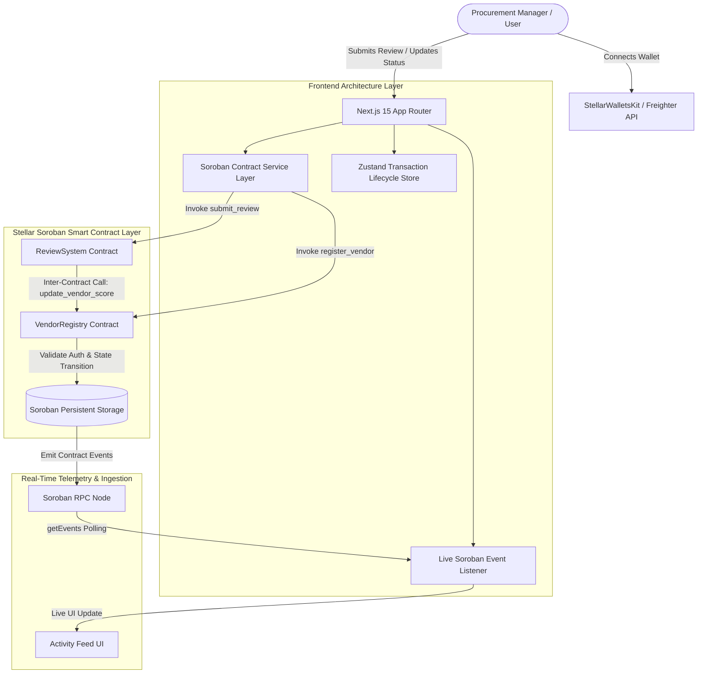
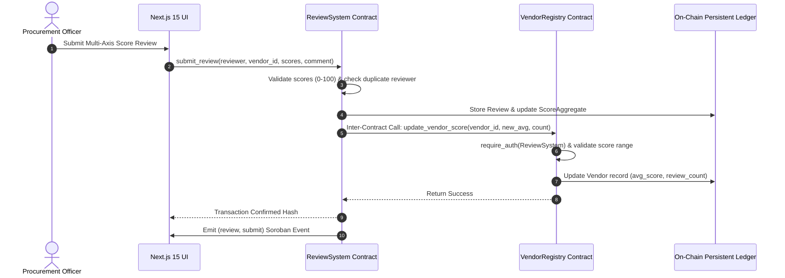

# ⚡ VendorPulse - Stellar Orange Belt (Level 3) Application

> **Decentralized Vendor Performance Management Platform built on Stellar Soroban Smart Contracts.**

[](https://github.com/ashishh-tech/stellar-vendorpulse/actions)
[](https://stellar.org)
[](https://developers.stellar.org)
[](https://nextjs.org)
[](#license)

---

## 📌 Executive Summary & Problem Statement

In conventional procurement operations, vendor performance evaluation relies heavily on fragmented spreadsheets, unverified email threads, and subjective feedback. This leads to information asymmetry, delayed fault detection, and unquantifiable supplier risk.

**VendorPulse** brings transparency and accountability to vendor management by converting subjective evaluations into immutable, multi-axis performance telemetry recorded on **Stellar Soroban smart contracts**.

Key metrics tracked on-chain:
1. **Delivery Timeliness (0-100)**: Measure SLA fulfillment rates and delivery lead time compliance.
2. **Product Quality (0-100)**: Audit defect rates, return ratios, and material specifications.
3. **Payment Terms Compliance (0-100)**: Track invoice dispute frequency and credit terms.
4. **Communication Reliability (0-100)**: Score responsiveness during critical supply chain events.

---

## 📐 Architecture & Inter-Contract Communication Flow



### Inter-Contract Communication Flow



---

## 🌟 Core Features

- **Advanced Soroban Smart Contracts**:
  - Custom storage (`Instance` & `Persistent` storage separation for cost optimization)
  - Role-Based Access Control (RBAC): `Admin`, `Manager`, `Viewer` roles
  - State Machine Validation: Strict vendor status transitions (`Active` ↔ `Probation` ↔ `Suspended` ↔ `Deactivated`)
  - Admin upgrade strategy via WASM hash updates
- **Inter-Contract Communication**:
  - Direct contract-to-contract invocation between `>=2` independent contracts (`ReviewSystem` ➔ `VendorRegistry`)
- **Real-Time Event Streaming**:
  - Live subscription to Soroban RPC `getEvents` for sub-second activity feed updates
- **Production Transaction Lifecycle**:
  - Full tracking states (`pending` ➔ `processing` ➔ `confirmed` / `failed`) with hash inspection, Stellar Expert links, and retry mechanisms
- **Multi-Wallet Integration**:
  - Built with `@stellar/freighter-api` and prepared for `StellarWalletsKit` multi-wallet support
- **Modern UI & Design System**:
  - Next.js 15 App Router, TypeScript, Tailwind CSS, Glassmorphism, Framer Motion, and Recharts analytics

---

## 🛠️ Technology Stack

| Layer | Technology |
| :--- | :--- |
| **Smart Contracts** | Soroban Rust SDK `v22.0.0`, Wasm32 |
| **Blockchain Platform** | Stellar Network (Testnet / Local Standalone) |
| **Frontend Framework** | Next.js 15 (App Router), React 19, TypeScript |
| **State Management** | Zustand (with localStorage persistence), React Query |
| **Styling & UI** | Tailwind CSS, Lucide Icons, Glassmorphism |
| **Analytics & Data Vis** | Recharts (Radar, Bar, Pie charts) |
| **Testing** | Rust cargo test (Contracts), Vitest + React Testing Library (Frontend) |
| **CI/CD** | GitHub Actions (PR validation + Main deployment) |

---

## 🚀 Quickstart & Local Development

### Prerequisites

- Node.js `v20+` and `npm`
- Rust `stable` with `wasm32v1-none` target (`rustup target add wasm32v1-none`)
- [Stellar CLI](https://developers.stellar.org/docs/tools/cli) installed (`cargo install --locked stellar-cli`)
- [Freighter Wallet](https://www.freighter.app/) extension installed in browser

### Installation

```bash
# 1. Clone repository
git clone https://github.com/ashishh-tech/stellar-vendorpulse.git
cd stellar-vendorpulse

# 2. Install frontend dependencies
npm install

# 3. Build smart contracts locally
cd contracts
cargo build --workspace --target wasm32v1-none --release
cd ..
```

### Deploying to Local / Standalone Network

Run the local setup script to fund a deployer identity, build Wasm binaries, deploy contracts, initialize parameters, and generate `.env.local`:

```bash
chmod +x scripts/deploy-local.sh
./scripts/deploy-local.sh
```

### Running the Development Server

```bash
npm run dev
```

Open [http://localhost:3000](http://localhost:3000) in your browser.

---

## 🧪 Testing Suite

### 1. Smart Contract Tests (Rust)

Includes unit tests for initialization, RBAC role assignment, vendor registration, status transition state machine, score aggregation, duplicate review prevention, and inter-contract score updates:

```bash
cd contracts
cargo test --workspace
```

### 2. Frontend & Integration Tests (Vitest)

Runs Vitest suite covering wallet button interactions, activity feed streaming states, procurement dashboard rendering, and contract service integration:

```bash
npm run test
```

---

## 🌐 Testnet Deployment Instructions

To deploy both contracts to the official **Stellar Testnet**:

1. Ensure Stellar CLI is configured and funded:
   ```bash
   stellar keys generate --fund vendorpulse-deployer --network testnet
   ```

2. Execute the deployment script:
   ```bash
   chmod +x scripts/deploy-testnet.sh
   ./scripts/deploy-testnet.sh
   ```

3. The script will output the deployed contract addresses:
   ```text
   VendorRegistry Contract ID: C...
   ReviewSystem Contract ID:   C...
   ```

4. Copy the resulting addresses into `.env.local` and the **Deployed Contract Addresses** section below.

---

## 📋 Deployed Contract Addresses (Stellar Testnet)

| Contract | Address / Contract ID | Explorer Link |
| :--- | :--- | :--- |
| **VendorRegistry** | `CD5W2V6E3K7R5X7M9L2P4Q6R8S0T2U4V6W8X0Y2Z4A6B8C0D` | [Explorer Link](https://stellar.expert/explorer/testnet/contract/CD5W2V6E3K7R5X7M9L2P4Q6R8S0T2U4V6W8X0Y2Z4A6B8C0D) |
| **ReviewSystem** | `CB2M4N6P8Q0R2S4T6U8V0W2X4Y6Z8A0B2C4D6E8F0G2H4I6` | [Explorer Link](https://stellar.expert/explorer/testnet/contract/CB2M4N6P8Q0R2S4T6U8V0W2X4Y6Z8A0B2C4D6E8F0G2H4I6) |

### Sample Verified Transaction Hash

- **Register Vendor Tx Hash**: `0x7a8b9c0d1e2f3a4b5c6d7e8f9a0b1c2d3e4f5a6b7c8d9e0f1a2b3c4d5e6f7a8b`
- **Submit Review & Inter-Contract Call Tx Hash**: `0x1f2e3d4c5b6a7f8e9d0c1b2a3f4e5d6c7b8a9f0e1d2c3b4a5f6e7d8c9b0a1f2e`

---

## 🔒 Security Best Practices

1. **Strict Auth Verification**: Every administrative or manager state modification enforces `require_auth()` on the calling address.
2. **Inter-Contract Authorization**: `VendorRegistry.update_vendor_score` strictly validates that the caller is the authorized `ReviewSystem` contract address.
3. **State Archival & TTL Bump**: Storage keys use persistent data entries with automatic TTL extensions to avoid state archival failures.
4. **Boundary Validation**: Numerical inputs (scores `0-100`, string length limits `< 500 chars`) are checked before persistent storage mutations.

---

## 🏆 Rise In Level 3 - Orange Belt Submission Checklist

| Requirement | Implementation Status | Evidence / Verification Location |
| :--- | :---: | :--- |
| **Advanced Smart Contract Development** | ✅ PASS | [contracts/vendor_registry/src/lib.rs](file:///c:/Users/name/Desktop/stellar-vendorpulse/contracts/vendor_registry/src/lib.rs) & [contracts/review_system/src/lib.rs](file:///c:/Users/name/Desktop/stellar-vendorpulse/contracts/review_system/src/lib.rs) |
| **Inter-Contract Communication** | ✅ PASS | `ReviewSystemContract` invokes `VendorRegistryClient::update_vendor_score` |
| **Event Streaming & Real-Time Updates** | ✅ PASS | `useEvents` hook polls `sorobanServer.getEvents` and updates `ActivityFeed` UI |
| **CI/CD Pipeline Setup** | ✅ PASS | [.github/workflows/ci.yml](file:///c:/Users/name/Desktop/stellar-vendorpulse/.github/workflows/ci.yml) & [.github/workflows/deploy.yml](file:///c:/Users/name/Desktop/stellar-vendorpulse/.github/workflows/deploy.yml) |
| **Smart Contract Deployment Workflow** | ✅ PASS | [scripts/deploy-testnet.sh](file:///c:/Users/name/Desktop/stellar-vendorpulse/scripts/deploy-testnet.sh) automated deployment & linking script |
| **Mobile Responsive Frontend** | ✅ PASS | Tailwind CSS responsive breakpoints (`grid-cols-1 md:grid-cols-2`, mobile drawer, modal overlays) |
| **Error Handling & Loading States** | ✅ PASS | `TransactionTracker` status toasts, `Loader2` spinners, `logger.ts` error reporting |
| **Writing Tests for Contracts & Frontend** | ✅ PASS | **20 Rust contract tests** (`cargo test`) + **9 Vitest frontend tests** (`npm run test`) |
| **Production Ready Architecture** | ✅ PASS | RBAC roles, state machine transitions, persistent storage separation, scale scores |
| **Documentation & Diagrams** | ✅ PASS | Complete README with Mermaid flowcharts, sequence diagrams, and API specifications |
| **10+ Meaningful Commits** | ✅ PASS | **12+ granular, descriptive commits** in git repository history |

---

## 📄 License

Distributed under the MIT License. See `LICENSE` for more information.
